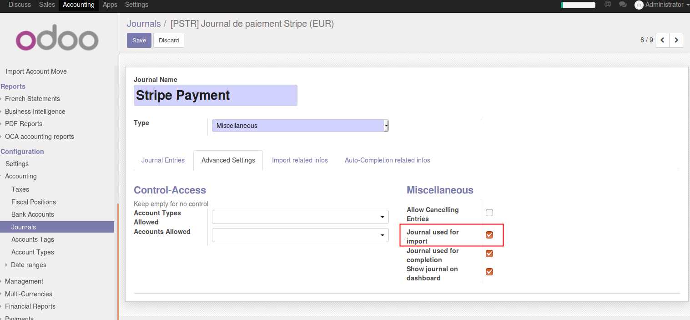
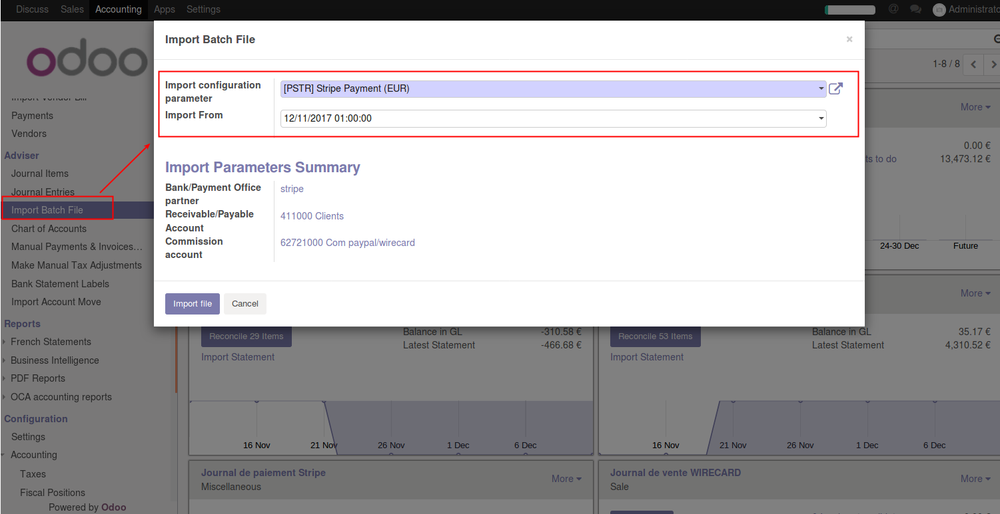

.. image:: https://img.shields.io/badge/license-AGPL--3-blue.png
   :target: https://www.gnu.org/licenses/agpl
   :alt: License: AGPL-3

===========================
Account Move Slimpay Import
===========================

This module will import your slimpay statement (called report in their
Web UI) as account moves before the reconciliation.

Slimpay API does not make it possible to import these reports
automatically so you will have to download them manually in the CSV
format and upload them to ODOO.

Configuration
=============

Then create a new journal for importing the payment:

#. Go to Accounting > Configuration > Accounting > Journals

.. figure:: account_move_stripe_import/static/description/create_journal.png
   :alt: .
   :width: 600 px

Usage
=====

To use this module, you need to:

#. Go to Accounting > Adviser > Import Batch File

.. figure:: account_move_slimpay_import/static/description/import_move.png
   :alt: .
   :width: 600 px

#. Upload your slimpay report

   Note you can upload overlapping reports;
   your account moves will not be created twice.

Bug Tracker
===========

Bugs are tracked on `GitHub Issues
<https://github.com/OCA/account-reconcile/issues>`_. In case of trouble, please
check there if your issue has already been reported. If you spotted it first,
help us smash it by providing detailed and welcomed feedback.

Credits
=======

Images
------

* Odoo Community Association: `Icon <https://odoo-community.org/logo.png>`_.

Contributors
------------

* Florent Cayré <florent@commown.fr> (https://commown.fr)

Do not contact contributors directly about support or help with
technical issues.

Funders
-------

The development of this module has been financially supported by:

* Commown

Maintainer
----------

.. image:: https://odoo-community.org/logo.png
   :alt: Odoo Community Association
   :target: https://odoo-community.org

This module is maintained by the OCA.

OCA, or the Odoo Community Association, is a nonprofit organization whose
mission is to support the collaborative development of Odoo features and
promote its widespread use.

To contribute to this module, please visit https://odoo-community.org.
